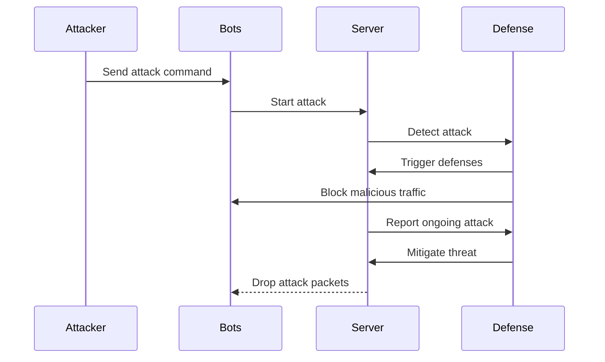

## Documentation
First the attacker bends the commands to the Bots.
Which then starts the attack by sending it to the server.
The defense then detects the attack and triggers the dense systems.
The defense blocks all the malicious traffic from the bots.
The Server reports the attacks to the defense and the defense mitigates the threat. The Server may drop attack packets back to the bots.
