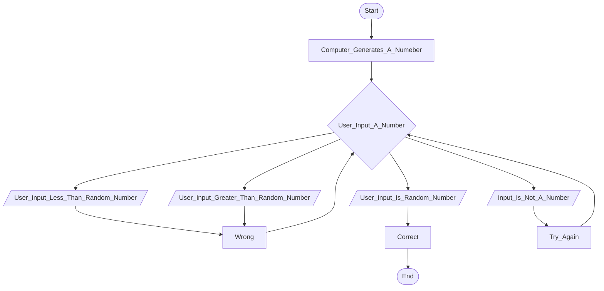

## Documentation
First the computer generates a number

Then the user is asked to guess what they think the number is 

Based on the users input it goes to either input is greater than, input is less than, input is the same or input is not a number

If the input is greater than or input is less than it goes to wrong

Wrong then goes back to user intputs a number

If input is not a number it goes to try again

Try again then goes back to user inputs a number

If input is the same then it goes to correct

Correct then goes to end and ends the cycle