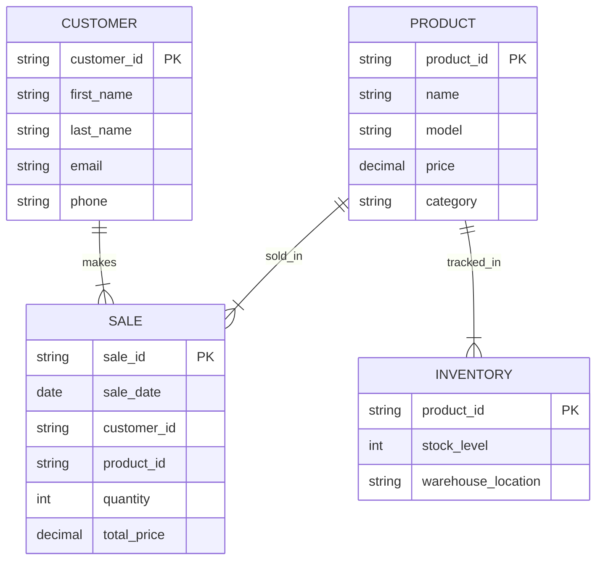

## Documentation
PRODUCT ||--|{ SALE: This means a product can be sold in many sales, but each sale only includes one product. So, lots of people can buy the same cool sneakers.

CUSTOMER ||--|{ SALE: A customer can make many sales, but each sale is tied to one customer. Like, if Alex buys sneakers and a shirt, those are two different sales, but both are by Alex.

PRODUCT ||--|{ INVENTORY: A product can be tracked in the inventory, so you know how many you have and where they are stored